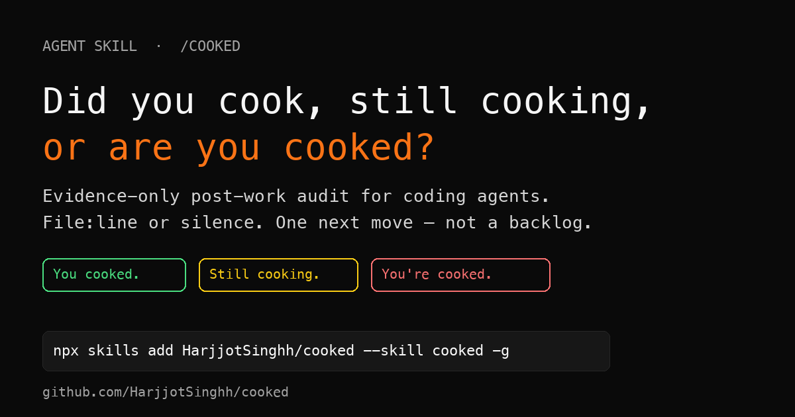

# cooked

[](https://skills.sh/HarjjotSinghh/cooked)

<p align="center">
  
</p>

> Did you cook, are you still cooking, or are you cooked?

A [Matt Pocock](https://github.com/mattpocock/skills)-style skill for coding agents. Run it **after** a feature is "done" — not before.

It reads the diff and the original ask, then returns a branded verdict plus what's *actually* unfinished: silently dropped requirements, code that was written but never wired up, contracts that drifted, tests that don't cover the new paths, and ship blockers.

Every item cites a `file:line` or a command it ran. Anything it can't cite, it doesn't say.

It ends with **one** next action, not a backlog.

```text
/cooked
```

## Why not just ask "what's next?"

Because you'll get: *add more tests, improve error handling, consider adding monitoring.* Ten items that could have been written before the agent opened your repo.

This skill bans that list by name and forces evidence for every claim. The constraint *is* the product — same reason [`grill-me`](https://github.com/mattpocock/skills/blob/main/skills/productivity/grill-me/SKILL.md) works.

## Verdicts

| Verdict | Meaning |
|---|---|
| **You cooked.** | Done, verified, ship-clear — or genuinely nothing left. |
| **Still cooking.** | Incomplete, unverified, unwired, or not live yet. |
| **You're cooked.** | Material bugs, failed criteria, regressions, or production risk. |

The double meaning is intentional. Ambiguity ships.

## Install

Portable [Agent Skills](https://agentskills.io/specification) layout — one `SKILL.md`, **70+ agents**.

```bash
# all detected agents, globally
npx skills add HarjjotSinghh/cooked --skill cooked -g

# every agent the CLI knows about
npx skills add HarjjotSinghh/cooked --skill cooked --agent '*' -g -y

# pick agents
npx skills add HarjjotSinghh/cooked --skill cooked \
  -a claude-code -a codex -a cursor -a opencode -a gemini-cli \
  -a github-copilot -a pi -a grok -a windsurf -g
```

Then say `cooked`, `/cooked`, `did I cook`, or `am I cooked` when you're done with something.

### Per-agent guides

Full docs live under **[`docs/`](./docs/)**:

| | |
|---|---|
| [One-command install](./docs/install.md) | `npx skills` options, update, remove |
| [All agents matrix](./docs/all-agents.md) | 70+ agents — `--agent` id + paths |
| [Claude Code](./docs/agents/claude-code.md) · [Codex](./docs/agents/codex.md) · [Cursor](./docs/agents/cursor.md) | major harness guides |
| [OpenCode](./docs/agents/opencode.md) · [Gemini CLI](./docs/agents/gemini-cli.md) · [Copilot](./docs/agents/github-copilot.md) | |
| [Pi](./docs/agents/pi.md) · [Grok Build](./docs/agents/grok-build.md) · [Windsurf](./docs/agents/windsurf.md) | |
| [Cline](./docs/agents/cline.md) · [Continue](./docs/agents/continue.md) · [Amp/Replit](./docs/agents/amp.md) | |
| [Goose](./docs/agents/goose.md) · [Roo](./docs/agents/roo-code.md) · [Antigravity](./docs/agents/antigravity.md) · [OpenClaw](./docs/agents/openclaw.md) | |

### Quick manual paths

| Agent | Global skill path |
|---|---|
| Claude Code | `~/.claude/skills/cooked/` |
| Codex | `~/.codex/skills/cooked/` |
| Cursor | `~/.cursor/skills/cooked/` |
| OpenCode | `~/.config/opencode/skills/cooked/` |
| Gemini CLI | `~/.gemini/skills/cooked/` |
| GitHub Copilot | `~/.copilot/skills/cooked/` |
| Pi | `~/.pi/agent/skills/cooked/` |
| Grok Build | `~/.grok/skills/cooked/` |

Optional slash-command / TOML ports: [`adapters/`](./adapters/). Full table: [`docs/all-agents.md`](./docs/all-agents.md).

### From this repo

```bash
git clone https://github.com/HarjjotSinghh/cooked.git
cp -R cooked/skills/cooked ~/.claude/skills/cooked   # Claude Code example
```

## The design in one line

Read-only · evidence-or-silence · max 3 per bucket · one next action · branded verdict.

### Six sweeps

1. **Broken promises** — TODOs, stubs, "not implemented", temp hardcodes in *this* diff  
2. **Dead wiring** — new exports/routes/handlers with zero call sites  
3. **Contract drift** — type/schema/API/DB changes with unupdated consumers  
4. **Verification gaps** — real typecheck/lint/test/build failures; untested new paths  
5. **Ship mechanics** — env, migrations, flags, lockfile, secrets  
6. **Spec delta** — every original requirement: done / partial / **silently dropped**

### Next-move ladder

`Finish → Prove → Ship → Observe → Advance → Stop`

Earliest applicable wins. Optional polish never outranks unfinished scope.

## Example

**Slop answer** (ask any agent "what's next?" cold):

```text
1. Add more unit tests
2. Improve error handling
3. Consider adding monitoring
4. Update the documentation
5. Refactor for readability
```

**`/cooked` answer** (evidence only):

```text
## Verdict
**Still cooking.**
Billing webhook is registered but never called from the checkout success path.

## Scope
12 files since origin/main · against issue #88

## Findings
### BLOCKING
1. `handleStripeWebhook` exported, zero call sites — `src/billing/webhook.ts:14`
   Checkout success never hits the webhook route; paid users stay "pending".

### Spec delta
| Requirement | Status |
|---|---|
| Process Stripe webhook on success | silently dropped |
| Show paid status in UI | partial |

## Don't start yet
Don't start the admin dashboard redesign — the money path is still open.

## → Next
Wire `handleStripeWebhook` into the checkout success handler · Finish
Done when a successful test payment flips the user to `paid` in the DB.
```

That contrast *is* the pitch. Screenshot both. Ship the post.

## Repo layout

```text
cooked/
├── skills/cooked/SKILL.md     # canonical skill (Agent Skills spec)
├── adapters/                  # slash-command ports for non-skill agents
├── assets/og-card.png         # share / OG image (default)
├── docs/                      # install + per-agent guides (70+ agents)
│   ├── install.md
│   ├── all-agents.md
│   └── agents/
├── examples/                  # sample before/after + launch posts
├── LICENSE
└── README.md
```

## Pairs well with

- [`grill-me`](https://github.com/mattpocock/skills/blob/main/skills/productivity/grill-me/SKILL.md) — before you build. This is the bookend after.
- Code review skills — check *how* the code is written. This checks *what's missing*.

## Spec compliance

Follows the open [Agent Skills specification](https://agentskills.io/specification):

- `name` matches parent folder (`cooked`)
- `description` includes when-to-use triggers
- Portable `SKILL.md` body; adapters only for agents that don't load skills yet

## Contributing

PRs welcome. Keep the skill short. If a change makes the agent dump a backlog or invent chores, reject it.

## Distribution

**Share image (canonical):** [`assets/og-card.png`](./assets/og-card.png)

```text
https://raw.githubusercontent.com/HarjjotSinghh/cooked/main/assets/og-card.png
```

Launch copy, X/HN/Reddit posts, and the screenshot pair:

- [`docs/distribution.md`](./docs/distribution.md) — channels + checklist  
- [`examples/launch-post.md`](./examples/launch-post.md) — paste-ready posts (attach `og-card.png`)  
- [`examples/before-after.md`](./examples/before-after.md) — the contrast that sells it  
- [`assets/README.md`](./assets/README.md) — OG variants  

```bash
npx skills add HarjjotSinghh/cooked --skill cooked -g
```

## License

[MIT](./LICENSE)
